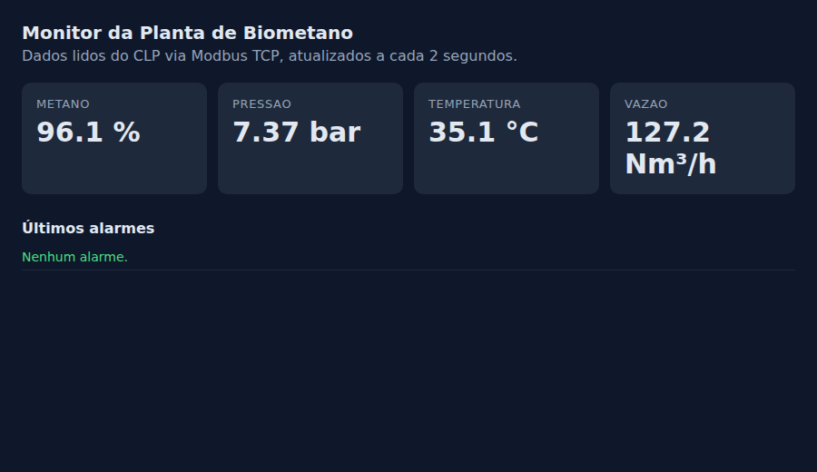

# Monitor de Planta de Biometano — Modbus TCP → SQLite → API REST

Projeto de estudo de **integração IT/OT** (Indústria 4.0): coleta dados de um CLP via **Modbus TCP**, grava em banco **SQL** como série temporal, gera **alarmes** e disponibiliza tudo em uma **API REST** com um painel web.

Feito **100% em Python puro, sem nenhuma biblioteca externa**. O protocolo Modbus TCP foi implementado manualmente com `socket` e `struct` para entender como os dados trafegam, byte a byte, entre o CLP e o sistema de supervisão.



## Arquitetura

```
 ┌──────────────────┐   Modbus TCP    ┌──────────────┐    SQL     ┌──────────┐   HTTP/JSON   ┌──────────────┐
 │ simulador_clp.py │ ◄────────────── │  coletor.py  │ ─────────► │ dados.db │ ◄──────────── │    api.py    │
 │  (CLP simulado)  │  função 03      │  (gateway)   │  INSERT    │ (SQLite) │    SELECT     │ REST + painel│
 └──────────────────┘  porta 5020     └──────────────┘            └──────────┘               └──────────────┘
      Nível de campo (OT)                 Integração                                            Nível de TI
```

| Componente | O que faz |
|---|---|
| `simulador_clp.py` | Servidor Modbus TCP que imita o CLP de uma planta de biometano. Atualiza 4 holding registers a cada segundo: temperatura, pressão, vazão e teor de metano. |
| `coletor.py` | Cliente Modbus que lê os registradores a cada 2 s, converte a escala, grava no SQLite e registra alarmes quando um valor sai da faixa. Reconecta sozinho se a comunicação cair. |
| `api.py` | API REST que expõe os dados em JSON, com um painel web que se atualiza automaticamente. |

### Mapa de registradores

| Endereço | Tag | Unidade | Escala | Faixa normal (alarme fora dela) |
|---|---|---|---|---|
| 0 | temperatura | °C | ×10 | 25 – 50 |
| 1 | pressao | bar | ×100 | 6 – 9 |
| 2 | vazao | Nm³/h | ×10 | 80 – 170 |
| 3 | metano | % | ×10 | 90 – 100 |

Registradores Modbus guardam apenas inteiros de 16 bits (0 a 65535). Para transmitir decimais, o CLP multiplica pela escala (7,42 bar → 742) e o coletor divide de volta.

## Como rodar

Pré-requisito: **Python 3.8+**. Não precisa instalar mais nada.

Abra **3 terminais** na pasta do projeto e rode um comando em cada, nesta ordem:

```bash
python simulador_clp.py     # terminal 1: liga o CLP simulado
python coletor.py           # terminal 2: começa a coletar e gravar no banco
python api.py               # terminal 3: sobe a API
```

Depois abra **http://127.0.0.1:8000** no navegador para ver o painel.

## Endpoints da API

| Rota | Retorna |
|---|---|
| `GET /api/atual` | Último valor de cada tag |
| `GET /api/historico?tag=pressao&limite=20` | Últimas leituras de uma tag |
| `GET /api/resumo` | Mínimo, máximo, média e total de leituras por tag |
| `GET /api/alarmes?limite=20` | Últimos alarmes registrados |

Exemplo de resposta de `/api/atual`:

```json
[
  { "tag": "pressao", "valor": 7.37, "unidade": "bar", "momento": "2026-09-27T17:51:19" },
  { "tag": "metano",  "valor": 96.1, "unidade": "%",   "momento": "2026-09-27T17:51:19" }
]
```

## Banco de dados

Duas tabelas no SQLite (`dados.db`, criado automaticamente):

- **leituras** (`momento`, `tag`, `valor`, `unidade`): série temporal com um registro por tag a cada coleta, com índice em `(tag, momento)`.
- **alarmes** (`momento`, `tag`, `valor`, `mensagem`): eventos de valores fora da faixa.

## Detalhes do protocolo Modbus TCP implementado

Cada mensagem tem um cabeçalho **MBAP** (7 bytes) seguido do **PDU**:

```
Pedido (ler 4 registradores a partir do endereço 0):
 00 01 | 00 00 | 00 06 | 01 | 03 | 00 00 | 00 04
 id    | proto | tam.  | un.| fn | início| qtd.

Resposta:
 00 01 | 00 00 | 00 0B | 01 | 03 | 08 | 01 63  02 E6  04 B0  03 C2
                                  bytes  355    742    1200   962
```

Também são tratadas as **exceções Modbus**: função inválida (código 01) e endereço inválido (código 02).

## Conceitos praticados

- Integração **IT/OT**: dados do nível de campo chegando aos sistemas de TI
- Protocolo industrial **Modbus TCP** (cabeçalho MBAP, função 03, exceções)
- Modelagem de **série temporal** em banco **SQL**
- Lógica de **alarmes** por faixa de operação
- **API REST** com respostas JSON e tratamento de erros
- Resiliência: reconexão automática quando a comunicação com o CLP cai

## Próximos passos

- [ ] Trocar o SQLite por um banco de séries temporais (**InfluxDB**)
- [ ] Publicar as leituras via **MQTT** para outros sistemas consumirem
- [ ] Usar a biblioteca `pymodbus` e ler de um simulador de CLP real
- [ ] Criar a tela de supervisão em um SCADA (ex.: Elipse E3 demo)

---

Desenvolvido por **Victor Ventura**, estudante de Engenharia de Software, como projeto de estudo em automação industrial e Indústria 4.0.
